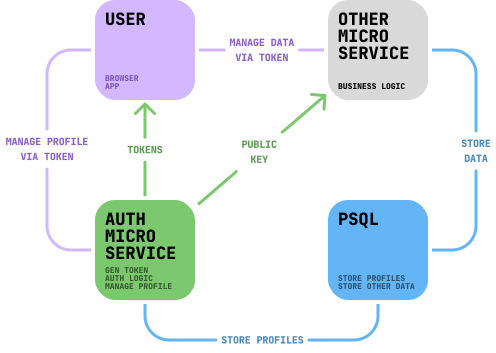

# FastAPI Postgres Auth Microservice

 [](https://github.com/tri6odin/FAP-AMS/blob/main/LICENSE.MD)

FAP-AMS is a lightweight and fast authentication service that allows users to create and edit profiles using a one-time code with support for two-factor authentication (2FA). It is designed to be simple and straightforward to integrate into your systems providing strong security mechanisms.

**The service does not include the function of sending SMS messages. This needs to be implemented as required by your provider in the `utils/sender.py` file.**

## How to use



The microservice stores the profiles of your users in your **Postgres** database and also generates tokens for their authorization in your other microservices. To verify the token you can get the **public_key** in the `/utils/public_key` endpoint.

## Features

- Ability to configure any parameter through the global config
- Support for Dev and Prod mode with varying degrees of exception detail
- JWT and RT tokens are encrypted with RS256 private and public keys
- Password hashed and salted
- Limitations frequency of generating tokens and sending one-time code
- Limitation of attempts to enter one-time code and password
- Regular background events to remove temporary accounts
- Simple logging system

## Configuration and Deployment

Before deployment, make sure you have **Postgres** installed and running. Settings for connecting to **Postgres** will need to be specified in `.env` or `config.py` depending on your deployment method.

### Docker

1. Clone repo:

```bash
git clone https://github.com/tri6odin/FAP-AMS
cd FAP-AMS
```

2. Modify the `.env` file with your settings.

3. To deploy, use the following commands:

```bash
docker build --no-cache -t auth_microservice .
docker run -d --env-file .env -p 8000:8000 auth_microservice
```

### Build

#### MacOS

1. Install Python and OpenSSL:

```bash
brew install python
brew install openssl
```

2. Clone repo:

```bash
git clone https://github.com/tri6odin/FAP-AMS
cd FAP-AMS
```

3. Generate keys:

```bash
mkdir -p ./keys
openssl genpkey -algorithm RSA -out ./keys/private_key.pem
openssl rsa -pubout -in ./keys/private_key.pem -out ./keys/public_key.pem
```

4. Create a virtual environment and Install the dependencies:

```bash
python3 -m venv venv
source venv/bin/activate
pip install --upgrade pip
pip install --no-cache-dir -r requirements.txt
```

5. Modify the `config.py` file with your settings.

6. Start the Uvicorn server:

```bash
uvicorn main:app --reload
```

After deployment, API documentation is available via Swagger and ReDoc on the `http://localhost:8000/docs` and `http://localhost:8000/redoc` endpoints or in the `http://localhost:8000/openapi.json` file.


## API Endpoints

The service defines several endpoints for managing authentication, user profiles, and more. Below are the actual endpoints provided by the API:

- `GET /utils/public_key`: Retrieve the public key.

- `POST /auth/code`: Request an authentication one-time code.
- `PUT /auth/token`: Request an authentication token.
- `PATCH /auth/refresh`: Refresh an authentication token.

- `PUT /user/profile`: Update user profile information.
- `DELETE /user/profile`: Delete a user profile.
- `PATCH /user/credentials`: Update user credentials.
- `POST /user/password`: Set or update a user's password.

## Dependencies

The project incorporates a number of powerful libraries and frameworks, each contributing to its robustness and efficiency:

- **FastAPI**: A modern, fast web framework for building APIs with Python 3.7+, based on standard Python type hints.
- **Pydantic**: Utilized for data parsing and validation using Python type hints, and supports automatic generation of JSON schema for data models.
- **Asyncpg**: A library for asynchronous PostgreSQL database interaction, enhancing database operation performance.
- **SQLAlchemy**: Offers a comprehensive set of tools for SQL and ORM that facilitate efficient database interaction.
- **BCrypt**: Designed for secure password hashing.
- **Cryptography**: Contains cryptographic recipes and primitives for securing data.
- **PyJWT**: Enables encoding and decoding of JWT tokens, commonly used for authentication in web services.
- **APScheduler**: Python library that lets you schedule your code to be executed periodically.

## Contributing

Contributions to the FAP-AMS project are welcome. Please ensure to follow the project's coding standards and submit your pull requests for review.

## Acknowledgements

A significant portion of the code (95%) was generated using ChatGPT-4, designed and tested by humans.

## Support FAP-AMS

All donations support continued development. Thanks!

- Bitcoin (BTC): `18xTkZNXgTJPjLDE78zSy8o479TTNs3Jd3`
- TON (TON): `UQAokcJWPgkoNV8HXTF1pCPEhjVE02ZlL9wb5xD9WBLu4_63`

## License

This project is licensed under the [MIT License](https://github.com/tri6odin/FAP-AMS/blob/main/LICENSE).
